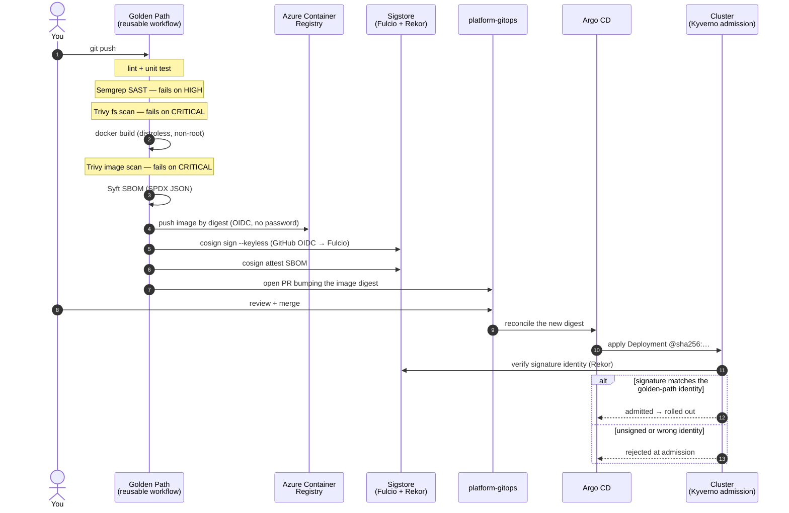

# platform-golden-path

**The paved road.** Point your service's CI at one reusable workflow and you get
security by default: static analysis, dependency and image scanning, a signed
image with an SBOM, and an automatic pull request to promote it — no security
knowledge required and no tickets to file. This README is for you, the developer
adopting it. You do not need to understand Sigstore or Kyverno to use the road;
this just explains what happens after you push.

## Quickstart

Either click **Use this template** on [`templates/service-go`](templates/service-go)
or [`templates/service-python`](templates/service-python) (they ship with this
wired up), or drop this file into your repo at `.github/workflows/ci.yml`:

```yaml
# Go (default):
name: CI
on: [push, pull_request]
permissions:
  contents: read
  id-token: write
  actions: read
  security-events: write
jobs:
  golden-path:
    uses: frhnardi/platform-golden-path/.github/workflows/golden-path.yml@<SHA>
    with:
      service-name: my-service
    secrets: inherit
```

```yaml
# Python — add language: python:
  golden-path:
    uses: frhnardi/platform-golden-path/.github/workflows/golden-path.yml@<SHA>
    with:
      service-name: my-python-service
      language: python
    secrets: inherit
```

The call itself is ~15 lines for Go, ~15 lines for Python (`uses:` →
`secrets: inherit`). The rest is the boilerplate GitHub requires: event triggers,
and the permissions that OIDC signing and SARIF upload can only be granted from
the calling workflow.

**What your org provides once, so you don't have to:** the Azure/ACR identifiers
as repository *variables* (`AZURE_CLIENT_ID`, `AZURE_TENANT_ID`,
`AZURE_SUBSCRIPTION_ID`, `ACR_NAME`) and the GitOps App credentials as *org
secrets* (forwarded by `secrets: inherit`). No secrets live in your repo.

## What runs when you push



Steps 1–13 are this repo. The merge is yours. Steps 15–19 are the platform's
delivery layer — shown so you can see why a build that never signs will never
deploy.

## What blocks your build vs. what only tells you

Severity gates are policy, not a suggestion ([ADR-0008]). A finding **at or above
the gate fails the build**; everything below it is still reported to the
repository's **Security → Code scanning** tab (as SARIF) but does **not** block.

| Stage | Looks for | **Blocks at** | Below the gate |
|---|---|---|---|
| Semgrep (SAST) | Security bugs in your source | **HIGH** and above | Reported to code scanning, non-blocking |
| Trivy — filesystem (SCA) | Known CVEs in your dependencies | **CRITICAL** | Reported to code scanning, non-blocking |
| Trivy — image | Known CVEs in the built image / base layers | **CRITICAL** | Reported in the job log, non-blocking |

When something blocks, the failing step prints **what** failed, **why** it
matters, and the **next step** — read the job summary first. You cannot quietly
raise a threshold to go green: that needs a documented exception, not a workflow
edit ([ADR-0008]).

## Verify it yourself

Every image pushed by the golden path is signed keylessly ([ADR-0005]): the
signing identity is the workflow's GitHub OIDC token — there is no cosign key
pair to distribute, leak, or rotate. The image's SBOM is attached as a signed
attestation. Anyone can verify both:

```bash
cosign verify \
  --certificate-identity-regexp '^https://github\.com/frhnardi/platform-golden-path/\.github/workflows/golden-path\.yml@' \
  --certificate-oidc-issuer https://token.actions.githubusercontent.com \
  <acr>.azurecr.io/<service-name>@sha256:<digest>

# and the SBOM attestation:
cosign verify-attestation --type spdx \
  --certificate-identity-regexp '^https://github\.com/frhnardi/platform-golden-path/\.github/workflows/golden-path\.yml@' \
  --certificate-oidc-issuer https://token.actions.githubusercontent.com \
  <acr>.azurecr.io/<service-name>@sha256:<digest>
```

Every pipeline run prints this exact block — with the concrete image digest
filled in — in the step summary of the `sign-and-attest` job.

> ⚠️ **The `--certificate-identity-regexp` is the enforcement contract.** The
> Kyverno admission policy in `platform-gitops` verifies image signatures against
> exactly this identity (the reusable workflow's `job_workflow_ref`, i.e. this
> repository + workflow path). If this repository is renamed or
> `.github/workflows/golden-path.yml` moves, that policy must be updated **in the
> same change set**, or every deployment will be rejected at admission.

## Design decisions

Every property below is deliberate and backed by an Architecture Decision Record
in `platform-infra/docs/adr/`. If a choice ever surprises you, the ADR is the
"why".

| You get… | Because… | ADR |
|---|---|---|
| Stages always run in the same order | A build can't reach `push` or `sign` until the scans ahead of it pass — order *is* the guarantee | [ADR-0008] |
| Semgrep HIGH and Trivy CRITICAL block; the rest reports | Gates are policy; thresholds can't drift silently to force a green build | [ADR-0008] |
| Images are signed with **no keys anywhere** | The signer is your workflow's OIDC identity via Fulcio/Sigstore — nothing to leak or rotate | [ADR-0005] |
| **No static credentials** in your repo | ACR push and signing authenticate with short-lived GitHub OIDC tokens, not stored passwords | [ADR-0003] |
| Deployments are pinned **by digest, never by tag** | A tag is mutable; a `sha256:` digest is the exact bytes that were scanned and signed | [ADR-0008] |
| One tiny exception: a GitHub App key for the GitOps PR | Cross-repo writes can't use OIDC; the stored secret is a scoped, rotatable key that only mints short-lived tokens — see [docs/gitops-promotion.md](docs/gitops-promotion.md) | [ADR-0003] |

## More

- [`templates/service-go`](templates/service-go) — a ready-to-fork Go service on the road.
- [`docs/gitops-promotion.md`](docs/gitops-promotion.md) — how promotion PRs are opened and the one credential involved.
- [`CLAUDE.md`](CLAUDE.md) — the full pipeline contract and non-negotiable constraints.

Status: Phase 2 — pending Phase 1 completion.

[ADR-0003]: https://github.com/frhnardi/platform-infra/tree/main/docs/adr
[ADR-0005]: https://github.com/frhnardi/platform-infra/tree/main/docs/adr
[ADR-0008]: https://github.com/frhnardi/platform-infra/tree/main/docs/adr
